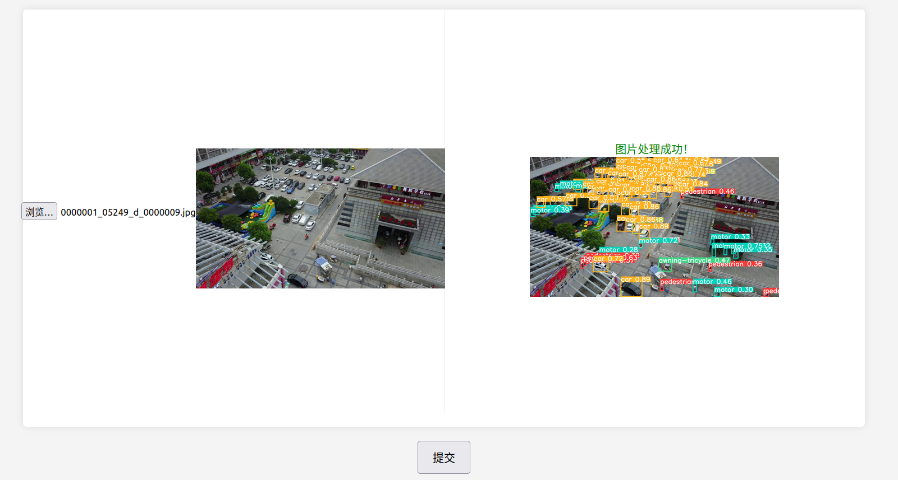

本项目简介：实现了一个高性能web服务器，采用主从Reactor网络模型，结合epoll+线程池+IO多路复用的技术，并利用时间轮定时踢掉超时的TCP连接，实现心跳检测的功能 后期再慢慢添加讲解说明  由浅入深剖析。

2024.10.4 更新： 结合我的硕士课题基于无人机的深度学习目标检测实现一个在线的支持高并发的目标检测识别器，浏览器仅测试使用，界面非常简单。后期考虑将图片放在数据库上。




---

2024.10.2更新 :  不仅支持常规的GET、POST请求，还在不依赖额外的库的情况下支持解析multipart/form-data，支持文件以及图片的上传


2024.9.19更新 ： 应用层利用内部提供的定时器实现心跳检测功能。


2024.9.20更新 ： 实现了时间轮，并利用时间轮定时踢掉超时的TCP连接。时间轮实现代码见src/keepalive，测试代码见example/server-timequeue


## 时间轮的作用

时间轮的作用是为了定时踢掉超时的TCP连接，所谓超时的TCP连接指的双方长时间没有通信的连接。由于这些超时连接没有通信，依然占用服务器资源，所以需要清理掉。服务器和客户端长时间不通信的两种情况如下：一种是连接正常，只是单纯不需要通信，这个不多讲，另一种是客户端出现意外，下面讲这种情况：
由于muduo不会主动关闭连接，都是等待客户端关闭后再关闭服务端（即使主动关闭也是先关闭自己的写端，等客户端关闭后，在关闭自己的读端，之所以这样做是为了服务器不会漏收对方消息，这里不展开说明），如果客户端意外断电关机，那么服务端就无法受到FIN，进而无法关闭连接，此时，如果应用层没有实现心跳机制、也没有为该连接的fd设置 `SO_KEEPALIVE`，该连接就会一直占用服务器资源。（P322 8.9.2）
为了避免上述无效连接浪费服务器资源，要么设置 `SO_KEEPALIVE`，要么应用层实现心跳机制。如果是 **实现心跳机制，就需要定时器实现的时间轮，用于以便定时清理无效连接** 。所以下面先讲定时器的实现，在讲时间轮的实现。
[]()

## 定时器实现思路

[](https://github.com/xyygudu/mymuduo/blob/main/muduo%E8%AE%B2%E8%A7%A3/%E7%AC%AC%E4%BA%8C%E9%83%A8%E5%88%86%EF%BC%884%EF%BC%89%EF%BC%9AMuduo%E6%97%B6%E9%97%B4%E8%BD%AE.md#定时器实现思路)

[]()

### 计时与定时函数的选择

[](https://github.com/xyygudu/mymuduo/blob/main/muduo%E8%AE%B2%E8%A7%A3/%E7%AC%AC%E4%BA%8C%E9%83%A8%E5%88%86%EF%BC%884%EF%BC%89%EF%BC%9AMuduo%E6%97%B6%E9%97%B4%E8%BD%AE.md#计时与定时函数的选择)

实现定时器，需要用到计时函数和定时函数，计时是为了让定时器知道超时的时刻，定时是为了超时后发出超时通知（通知可以是触发相应信号，也可以是文件描述符变得可读），便于后续做超时处理（如踢掉无效连接）。下面列举了个别计时函数和定时函数以及函数入选muduo的原因，更多函数请参考P241
 7.8.2节。
计时函数：gettimeofday(入选)、time
gettimeofday入选原因：

* time函数精度较低，有些场景计时是需要达到微妙级别的（比如日志打印时刻）， **gettimeofday精度就是微秒级别** 。
* **gettimeofday系统开销比time小** ，因为gettimeofday是在用户态实现的，没有陷入内核的开销。

定时函数：timerfd_create(入选)、sleep、alarm
timerfd_create入选原因：

* sleep会使得线程挂起不干事，也就无法处理IO；alarm是通过触发SIGALRM信号，陈硕大佬说过，多线程编程中，最好不要使用信号，具体原因不展开（P104， 4.10节）
* timerfd_create可以把时间抽象成文件描述符timerfd，当超时的时候，timerfd就变得可读。这种用文件描述符的方式可以注册到epoll中，以便和TCP连接上的IO事件统一处理。
  []()

### **认识Timestamp和timerfd**

[](https://github.com/xyygudu/mymuduo/blob/main/muduo%E8%AE%B2%E8%A7%A3/%E7%AC%AC%E4%BA%8C%E9%83%A8%E5%88%86%EF%BC%884%EF%BC%89%EF%BC%9AMuduo%E6%97%B6%E9%97%B4%E8%BD%AE.md#认识timestamp和timerfd)

在2.1节我们提到计时函数gettimeofday函数和定时timerfd_create函数创建的timerfd，其中gettimeofday是为了实现时间戳Timestamp类，timerfd是为了实现一个定时器。
Timestamp类：
 **Timestamp类记录的就是从1970年1月1号00:00开始到现在的毫秒数** ，毫秒是int64_t类型，这个毫秒数就是通过调用gettimeofday获得的，所以，Timestamp类可以简单看作就是一个int64_t，只不过多了一些成员方法。
timerfd：
关于timerfd，需要提到三个函数：timerfd_create、 **timerfd_settime（重要）** 、timer_gettime（muduo暂时没有用到，了解即可）。

```
int timer_create(int clockid,int flags);
```

此函数用于创建并返回timerfd，参数：

* clockid：常用取值为 `CLOCK_REALTIME`和 `CLOCK_MONOTONIC`，`CLOCK_REALTIME`表示相对时间，即从从1970.1.1到现在的时间，如果更改系统时间，从1970.1.1到现在时间就会发生变化。`CLOCK_MONOTONIC`表示绝对时间，获取的时间为系统最近一次重启到现在的时间，更该系统时间对其没影响
* flag：`TFD_NONBLOCK`(设置timerfd非阻塞)，`TFD_CLOEXEC`（fork子进程后在子进程中关掉父进程打开的文件描述符）

```c++
int timerfd_settime(int fd,int flags
                    const struct itimerspec *new_value
                    struct itimerspec *old_value);
// 形参结构体含义如下：
struct timespec {
    time_t tv_sec;                // 秒
    long   tv_nsec;               // 纳秒
};

struct itimerspec {
    struct timespec it_interval;  // 超时时间间隔
    struct timespec it_value;     // 超时时刻
};
  
```

此函数用于开启或者停止定时器。参数含义如下：

* fd：timerfd_create()返回的文件描述符
* flags：1代表设置的是绝对时间；为0代表相对时间
* new_value：指定新的超时信息（超时时刻和超时间隔）， **设定new_value.it_value非零则会在内核启动定时器** ，否则关闭定时器，如果new_value.it_interval为0，则定时器只触发一次
* old_value：返回原来的超时信息，如果不需要知道之前的超时信息，可以设置为NULL

```c++
int timerfd_gettime(int fd, struct itimerspec *curr_value);
  
```

此函数获取timerfd距离下一次超时还剩下多少时间。
[]()

### 定时器涉及到的类

[](https://github.com/xyygudu/mymuduo/blob/main/muduo%E8%AE%B2%E8%A7%A3/%E7%AC%AC%E4%BA%8C%E9%83%A8%E5%88%86%EF%BC%884%EF%BC%89%EF%BC%9AMuduo%E6%97%B6%E9%97%B4%E8%BD%AE.md#定时器涉及到的类)

| 类名       | 作用                                                                                                                                                                                                       |
| ---------- | ---------------------------------------------------------------------------------------------------------------------------------------------------------------------------------------------------------- |
| Timestamp  | 该类用于计时，该类有个常用的方法Timestamp::now()返回从1970年1月1号00:00到现在的毫秒数。另外可以重载了"<"，"=="。                                                                                           |
| Timer      | 定时器类。类内部记录着定时器的超时时刻、是否重复、重复时间间隔以及超时后要执行的回调函数。**注意：虽然Timer是定时器类，但是本身没有定时器功能，只是保存着定时器的数据，定时器功能是由timerfd实现的** |
| TimerQueue | 该类用于管理Timer类。虽然类名有“Queue”，但实际上该类内部存储Timer的TimerList容器是个STL的set容器，这是为了TimerQueue能高效的从TimerList中插入（添加）、删除、排序Timer                                   |

下面展示了Timerstamp、Timer和TimerQueue的主要成员和方法（可以粗看或者跳过）

```c++
class Timestamp
{
public:
    static Timestamp now();
private:
    // 表示时间戳的微秒数(自epoch开始经历的微妙数)
    int64_t microSecondsSinceEpoch_;
};
  
```

```
class Timer : noncopyable
{
public:
    void run() const { callback_(); }
    Timestamp expiration() const { return expiration_; }
    bool repeat() const { return repeat_; }
    // 重启定时器，其实就是修改一下下次超时的时刻
    void restart(Timestamp now);
private:
    const TimerCallback callback_;      // 定时器到期后要执行的回调函数
    Timestamp expiration_;              // 超时时刻
    const double interval_;             // 超时时间间隔，如果是一次性定时器，则该值应该设为0
    const bool repeat_;                 // 是否可重复使用（false表示一次性定时器）
};
```

```
class TimerQueue
{
public:
    // 通过调用insert向TimerList中插入定时器（回调函数，到期时间，时间间隔）
    void addTimer(TimerCallback cb, Timestamp when, double interval);
private:
    using Entry = std::pair<Timestamp, Timer*>;
    // set内部是红黑树，删除，查找效率都很高，而且是排序的，set中放pair默认是按照pair的第一个元素进行排序
    // 即这里是按照Timestamp从小到大排序
    using TimerList = std::set<Entry>;
    // 在自己所属的loop中添加定时器
    void addTimerInLoop(Timer *timer);
    // 定时器读事件触发的函数
    void handleRead();
    // 获取到期的定时器
    std::vector<Entry> getExpired(Timestamp now);
    // 重置这些到期的定时器（销毁或者重复定时任务）
    void reset(const std::vector<Entry>& expired, Timestamp now);
    // 插入定时器
    bool insert(Timer* timer);

    EventLoop* loop_;               // 所属的EventLoop
    const int timerfd_;             // timerfd是Linux提供的定时器接口
    TimerList timers_;              // 定时器队列（内部实现是红黑树）
};
```

[]()

### muduo定时器实现思路

[](https://github.com/xyygudu/mymuduo/blob/main/muduo%E8%AE%B2%E8%A7%A3/%E7%AC%AC%E4%BA%8C%E9%83%A8%E5%88%86%EF%BC%884%EF%BC%89%EF%BC%9AMuduo%E6%97%B6%E9%97%B4%E8%BD%AE.md#muduo定时器实现思路)

要实现定时器，只需要timerfd_create函数创建timerfd后，在epoll中关注timerfd的可读事件，然后通过timerfd_settime函数为timerfd指定超时时刻和超时间隔，就可以在内核启动一个定时器，当定时器到期后，epoll就会检测到timerfd可读，此时就会处理timerfd上的可读事件，即调用 `TimerQueue::handleRead`函数。从上述过程也可以看出，一个timerfd对应一个定时器，那多个定时器需要多个timerfd吗？ **muduo用了一个比较聪明做法，用一个timerfd就可以实现多个定时器的效果，其核心思想是：让timerfd的超时时刻总是设置为TimerQueue中最小的Timer的超时时刻** ，如下图所示：
[](https://camo.githubusercontent.com/0763de43601ac791797c95d9153b574064f94942791859aa01b73cae1ec9a3fc/68747470733a2f2f63646e2e6e6c61726b2e636f6d2f79757175652f302f323032332f7376672f32373232323730342f313638343330333433343838382d32373236646564372d643864312d346334352d393862622d3432633635633366383263382e73766723636c69656e7449643d7537663062303639642d623735372d342666726f6d3d64726f70266865696768743d3439342669643d753732326664333038266f726967696e4865696768743d343032266f726967696e57696474683d343832266f726967696e616c547970653d62696e61727926726174696f3d312e323526726f746174696f6e3d302673686f775469746c653d66616c73652673697a653d3734333934267374617475733d646f6e65267374796c653d6e6f6e65267461736b49643d7535346132313337382d626265622d346234312d613733642d3665633339643131643634267469746c653d2677696474683d353932)
假设当前时刻为50，即 `Timestamp::now()`返回50，TimerQueue中也已经添加了几个Timer，添加Timer时，timerfd的超时时刻也被设置为TimerQueue中最小的Timer的超时时刻，在上图中，timerfd此时的超时时刻为100(注：添加定时器是 `TimerQueue::addTimer`函数实现的)。为了简化，这里的Timer只画出了“超时时刻”和“时间间隔”，其中“时间间隔”为0表示这是一次性定时器，不为0表示重复定时器，重复时间间隔就是“时间间隔”中写的数字。

```c++
void TimerQueue::addTimer(TimerCallback cb,Timestamp when, double interval)
{
    Timer *timer = new Timer(std::move(cb), when, interval);
    loop_->runInLoop(std::bind(&TimerQueue::addTimerInLoop, this, timer));
}

void TimerQueue::addTimerInLoop(Timer* timer)
{
    // 将timer添加到TimerList（std::set<Entry>）时，判断其超时时刻是否是最早的
    bool eraliestChanged = insert(timer);

    // 如果新添加的timer的超时时刻确实是最早的，就需要重置timerfd_超时时刻
    if (eraliestChanged)
    {
        resetTimerfd(timerfd_, timer->expiration());
    }
}
  
```

当timerfd超时时（即此时时刻达到100时）timerfd可读，其可读事件会调用TimerQueue::handleRead函数，该函数需要经过如下4个步骤来完成定时器的更新：

* 步骤1：从TimerQueue中取出超时的Timer（实现函数为 `TimerQueue::getExpired`）。当前时刻为100，只要TimerQueue中Timer的超时时刻小于或者等于100，就认为超时，需要从TimerQueue中取出超时的Timer，此时TimerQueue中只剩下一个Timer，即超时时刻为120的Timer。
* 步骤2：遍历超时的Timer，分别执行该Timer保存的回调函数（该回调函数其实保存的就是EchoServer::onTimer函数）。
* 步骤3：重置超时Timer（实现函数为 `TimerQueue::reset`）。从TimerQueue中取出的两个Timer中，第一个Timer是一次性定时器，直接删除即可，第二个Timer是重复定时器，但是TimerQueue中此时没有这个Timer了，因此，我们需要修改一下该Timer的超时时刻，即设置该Timer的超时时刻为"当前时刻100"+"时间间隔50"=150，然后把它再次添加到TimerQueue中。此时TimerQueue中已经有了两个Timer，一个超时时刻是120，一个是刚添加的超时时刻是150。
* 步骤4：重新设置timerfd的超时时刻（实现函数为TimerQueue.cc的resetTimerfd函数）。前面说过，TimerQueue是个set，其内部是红黑树，会自动排序，此时，可以通过timerfd_settime函数重新设置timerfd的超时时刻为TimerQueue中最小的Timer，即timerfd下次的超时时刻为120。

TimerQueue::handleRead函数实现如下：

```c++
void TimerQueue::handleRead()
{
    Timestamp now = Timestamp::now();
    readTimerfd(timerfd_);

    // 步骤1：获取超时的定时器并挨个调用定时器的回调函数
    std::vector<Entry> expired = getExpired(now);
    callingExpiredTimers_ = true;
    for (const Entry& it : expired)
    {
        // 步骤2：执行该定时器超时后要执行的回调函数
        it.second->run();   
    }
    callingExpiredTimers_ = false;

    // 步骤3，4：这些已经到期的定时器中，有些定时器是可重复的，
    // 有些是一次性的需要销毁的，因此重置这些定时器
    reset(expired, now);
}
  
```

TimerQueue暴露出来的就只有一个方法：addTimer。TimerQueue已经帮我们都封装好了，只需要我们调用addTimer就能实现定时功能。现在EventLoop对TimerQueue::addTimer函数进行了进一步封装，实现了三个功能不同的定时器：runAt：在某时刻触发（一次性定时器）；runAfer：多久后触发（一次性定时器）；runEvery：每隔多久触发一次（重复定时器）。

```c++
void EventLoop::runAt(Timestamp time, Functor&& cb) {
    timerQueue_->addTimer(std::move(cb), time, 0.0);
}

void EventLoop::runAfter(double delay, Functor&& cb) {
    Timestamp time(addTime(Timestamp::now(), delay)); 
    runAt(time, std::move(cb));
}

void EventLoop::runEvery(double interval, Functor&& cb) {
    Timestamp timestamp(addTime(Timestamp::now(), interval)); 
    timerQueue_->addTimer(std::move(cb), timestamp, interval);
}
  
```

[]()

## 时间轮踢掉超时TCP连接

[](https://github.com/xyygudu/mymuduo/blob/main/muduo%E8%AE%B2%E8%A7%A3/%E7%AC%AC%E4%BA%8C%E9%83%A8%E5%88%86%EF%BC%884%EF%BC%89%EF%BC%9AMuduo%E6%97%B6%E9%97%B4%E8%BD%AE.md#时间轮踢掉超时tcp连接)

EventLoop提供了runEvery函数，可以实现每隔多少秒触发一次定时功能，那应该怎么实现时间轮并且定时踢掉超时连接的功能呢？
[]()

### 时间轮长什么样？

[](https://github.com/xyygudu/mymuduo/blob/main/muduo%E8%AE%B2%E8%A7%A3/%E7%AC%AC%E4%BA%8C%E9%83%A8%E5%88%86%EF%BC%884%EF%BC%89%EF%BC%9AMuduo%E6%97%B6%E9%97%B4%E8%BD%AE.md#时间轮长什么样)

muduo的时间轮使用的数据结构是boost::circle_buffer，是个循环队列，如下图左边所示，它有个尾指针tail始终指向circle_buffer的尾部，它的每个槽都存储的一个std::unordered_set容器，源码中把这个std::unordered_set取了个别名叫Bucket（译为“桶”）
[](https://camo.githubusercontent.com/40cc27343b35742848133d3010458503d8807ac93ef1a62eea3d445370a7cfce/68747470733a2f2f63646e2e6e6c61726b2e636f6d2f79757175652f302f323032332f7376672f32373232323730342f313638343333363134353031382d36353036313965622d643463622d343261322d383235382d3330393537373166303130322e73766723636c69656e7449643d7539373536383830622d313463642d342666726f6d3d64726f70266865696768743d3332342669643d753033306239646138266f726967696e4865696768743d323932266f726967696e57696474683d353432266f726967696e616c547970653d62696e61727926726174696f3d312e323526726f746174696f6e3d302673686f775469746c653d66616c73652673697a653d3332383637267374617475733d646f6e65267374796c653d6e6f6e65267461736b49643d7530626237346530622d626436312d343764362d393836612d3164306538303235386434267469746c653d2677696474683d363031)
Bucket中存储的是std::shared_ptr（至于为什么存储共享指针，后面会说）。Entry是个结构体，如下源码所示（定义在EchoServer中）。Entry有个WeakTcpConnectionPtr类型的成员，为了简化理解，我们就认为Entry存储的就是TcpConnection的共享指针，即TcpConnectionPtr。**现在需要关注的是，Entry结构体在析构的时候会调用TcpConnection的shutdown函数来关闭连接。所以可以认为只要Entry析构了，连接就关闭了。这对接下来理解连接是怎么被踢掉的很重要。**

```c++
struct Entry
{
    explicit Entry(const WeakTcpConnectionPtr& weakConn) : weakConn_(weakConn) {}
    ~Entry()
    {
        TcpConnectionPtr conn = weakConn_.lock();
        if (conn) conn->shutdown();
    }

	WeakTcpConnectionPtr weakConn_;
};

using EntryPtr = std::shared_ptr<Entry>;
using WeakEntryPtr = std::weak_ptr<Entry>;
using Bucket = std::unordered_set<EntryPtr>;
using WeakConnectionList = boost::circular_buffer<Bucket>;  // 时间轮
  
```

```c++

  
```

[]()

### 连接是怎么被添加进时间轮的？

[](https://github.com/xyygudu/mymuduo/blob/main/muduo%E8%AE%B2%E8%A7%A3/%E7%AC%AC%E4%BA%8C%E9%83%A8%E5%88%86%EF%BC%884%EF%BC%89%EF%BC%9AMuduo%E6%97%B6%E9%97%B4%E8%BD%AE.md#连接是怎么被添加进时间轮的)

假设每个TCP连接最多存活时间为8s，时间轮每一秒转动一下（借助EventLoop::runEvery函数实现重复定时），所以我们需要一个有8个桶时间轮，第1个桶放1秒之后将要超时的连接，第2个桶放2秒之后将要超时的连接。 **刚建立连接时或者某个连接一收到数据就把自己放到时间轮队尾的桶中，即第8个桶** （如3.1节右图所示，P251 7.10）

```c++
// 有新连接到来时，需要把连接添加到队尾的桶中
void EchoServer::onConnection(const TcpConnectionPtr& conn)
{
    if (conn->connected())
    {
        // 创建一个Entry，用来记录连接，即conn，Entry的析构函数会关闭连接
        EntryPtr entry(new Entry(conn));
        // 在时间轮的队尾的桶中插入Entry，可简单理解为插入连接
        connectionBuckets_.back().insert(entry);
        WeakEntryPtr weakEntry(entry);
        conn->setContext(weakEntry);
  	}
}
// 有新消息来的时候，把连接添加到队尾的桶中
void EchoServer::onMessage(const TcpConnectionPtr& conn, Buffer* buf, Timestamp time)
{
    WeakEntryPtr weakEntry(boost::any_cast<WeakEntryPtr>(conn->getContext()));
    EntryPtr entry(weakEntry.lock());
    if (entry)
    {
        // 在时间轮的队尾的桶中插入Entry，可简单理解为插入连接
        connectionBuckets_.back().insert(entry);
	}
}
  
```

```c++

  
```

[]()

### 时间轮怎么踢掉连接？

[](https://github.com/xyygudu/mymuduo/blob/main/muduo%E8%AE%B2%E8%A7%A3/%E7%AC%AC%E4%BA%8C%E9%83%A8%E5%88%86%EF%BC%884%EF%BC%89%EF%BC%9AMuduo%E6%97%B6%E9%97%B4%E8%BD%AE.md#时间轮怎么踢掉连接)

现在假设3.1节图右边两个连接在未来8秒不会收到新数据，1秒后（时间轮转动1次后）、7秒后和8秒后，时间轮分别如下图所示。
[](https://camo.githubusercontent.com/082d65ace7375b0b4d0c7fd1a6b110eaa8f8663db8b21011ecfb2e9020f4ee25/68747470733a2f2f63646e2e6e6c61726b2e636f6d2f79757175652f302f323032332f7376672f32373232323730342f313638343333323530343736342d31376130323634352d323263312d343261652d623963322d3531363564373832396231612e73766723636c69656e7449643d7561383263373662372d613139312d342666726f6d3d64726f702669643d753730633430643063266f726967696e4865696768743d323832266f726967696e57696474683d383933266f726967696e616c547970653d62696e61727926726174696f3d312e323526726f746174696f6e3d302673686f775469746c653d66616c73652673697a653d3439333539267374617475733d646f6e65267374796c653d6e6f6e65267461736b49643d7539646134663561382d666439652d343337652d383139642d3363633632313262626330267469746c653d)
**时间轮的转动是通过向队尾插入一个新桶实现的，circile_buffer有这样一个好处，满了之后（时间轮刚初始化的时候就是满的，只不过每个槽都是空桶），每向其队尾添加一个元素，队首元素自动弹出。**

```c++
// 超时回调函数
void EchoServer::onTimer()
{
    // 在时间轮队尾添加一个新的空桶，这样队首的桶自然被弹出，桶中的Entry引用计数为0
	// 就会被析构，Entry析构又会关闭连接
    connectionBuckets_.push_back(Bucket());
}
  
```

```c++

  
```

* 1秒后：向队尾添加新的一个空桶，队首被弹出，所以有连接的那个桶所在位置为7，就好像时间轮转动了一下一样。
* 7秒后：有连接的那个桶处于队首位置，因为每过1秒，队尾都会添加一个新桶，队首的桶不断被弹出，所以7秒后自己就处于队首位置了。
* 8秒后：有连接的那个桶自己被弹出，被弹出后会，桶会被析构（自然，桶中的每个元素，即 `std::shared_ptr<Entry>`，都会被析构），此时 `std::shared_ptr<Entry>`引用计数为0，会调用Entry的析构函数，而Entry的析构函数又会调用shutdown关闭连接，连接关闭后TcpConnectionPtr引用计数减为0，也就完成了TcpConnection的析构，**这就是为什么桶中要存共享指针的原因：circle_buffer弹出队首的桶后，桶中的Entry就会因为引用计数减为0，自动关闭连接。**

**************************************************************************************************************************************************************************************************************88

整体架构图：


## 好的网络服务器如何设计

在这个多核时代，服务端网络编程如何选择线程模型呢？ 赞同libev作者的观点：one loop per thread is usually a good model，这样多线程服务端编程的问题就转换为如何设计一个高效且易于使用的event loop，然后每个线程run一个event loop就行了（当然线程间的同步、互斥少不了，还有其它的耗时事件需要起另外的线程来做）
强大的nginx服务器采用了epoll+fork模型作为网络模块的架构设计，实现了简单好用的负载算法，使各个fork网络进程不会忙的越忙、闲的越闲，并且通过引入一把乐观锁解决了该模型导致的 服务器惊群现象，功能十分强大。

event loop 是 non-blocking 网络编程的核心，在现实生活中，non-blocking 几乎总是和 IO-multiplexing 一起使用，原因有两点：

- 没有人真的会用轮询 (busy-pooling) 来检查某个 non-blocking IO 操作是否完成，这样太浪费 CPU资源了。
- IO-multiplex 一般不能和 blocking IO 用在一起，因为 blocking IO 中 read()/write()/accept()/connect() 都有可能阻塞当前线程，这样线程就没办法处理其他 socket 上的 IO 事件了。

所以，当我们提到 non-blocking 的时候，实际上指的是 non-blocking + IO-multiplexing，单用其中任何一个都没有办法很好的实现功能

## Nginx为何是epoll+fork

强大的nginx服务器采用了epoll+fork模型作为网络模块的架构设计，实现了简单好用的负载算法，使各个fork网络进程不会忙的越忙、闲的越闲，并且通过引入一把乐观锁解决了该模型导致的 服务器惊群现象，功能十分强大
